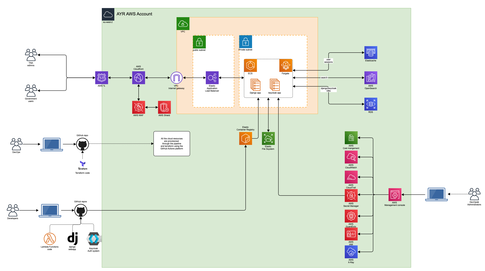
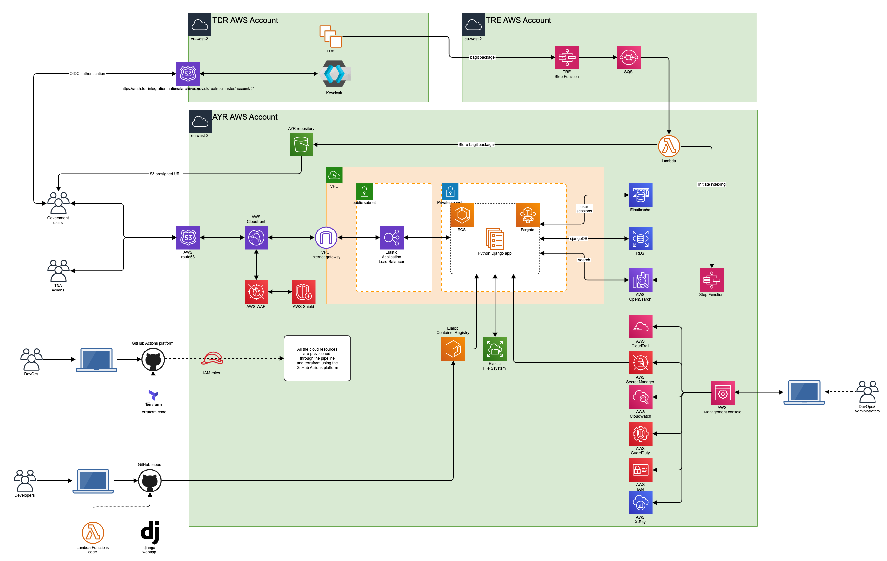

# AYR Design architecture - Alpha phase

Date: 16-12-2022

## Status

Accepted

## Context

This page shows the proposed design architecture for the Alpha phase.

## Decision

### Design architecture - stage-1

This is an early stage where there are no integrations with TDR and TRE services.

In this stage the team will prove:

- the [integration with Django and Keycloak](002-Django-keycloak-integration.md) for the authentication and authorisation
- the usage of the [GitHub Actions platform](https://github.com/nationalarchives/tre-blueprint-test-repository) to provision the infrastructure in AWS with Terraform

### Design architecture - stage-2

This stage is where AYR will integrate with TDR for the authentication and TRE for retreiving the data and store it in a S3 bucket.

In this stage the team will prove:

- the integration with the [TDR auth service](004-Shared-authentication-service.md)
- the integration with the [TRE service](003-TRE-integration.md)

### Roles used in the solution

* Developers
* DevOps
* Administrators
* TNA admin users
* Government department users

### AWS Services used in the solution

* [Amazon Elastic Container Service (ECS)](https://aws.amazon.com/ecs/) is a fully managed container orchestration service that makes it easy for you to deploy, manage, and scale containerized applications.
* [AWS Fargate](https://aws.amazon.com/fargate) is a serverless compute engine for containers that works with both [Amazon Elastic Container Service (ECS)](https://aws.amazon.com/ecs/) and [EKS](https://aws.amazon.com/eks/). Fargate makes it easy for you to focus on building your applications. Fargate removes the need to provision and manage servers, lets you specify and pay for resources per application, and improves security through application isolation by design.
* [Amazon Elastic Container Registry (ECR)](https://aws.amazon.com/ecr/) is a fully managed container registry that makes it easy to store, manage, share, and deploy your container images and artifacts anywhere.
* [Amazon Elasticache](https://aws.amazon.com/elasticache/) is a fully managed, in-memory caching service supporting flexible, real-time use cases. You can use ElastiCache for caching, which accelerates application and database performance, or as a primary data store for use cases that don't require durability like session stores. ElastiCache is compatible with Redis and Memcached.
* [Amazon RDS](https://aws.amazon.com/rds/) is a collection of managed services that makes it simple to set up, operate, and scale databases in the cloud.
* [Amazon OpenSearch](https://aws.amazon.com/what-is/opensearch/) provides a highly scalable system for providing fast access and response to large volumes of data, it is powered by the Apache Lucene search library, and it supports a number of search and analytics capabilities.
* [AWS Identity and access management for Amazon EKS](https://docs.aws.amazon.com/eks/latest/userguide/security-iam.html), IAM administrators control who can be authenticated (signed in) and authorized (have permissions) to use Amazon EKS resources. [OpenID Connect (OIDC) Identity Provider (IDP)](https://aws.amazon.com/blogs/containers/introducing-oidc-identity-provider-authentication-amazon-eks/) feature allows customers to integrate an OIDC identity provider with the Amazon EKS cluster running Kubernetes version 1.16 or later. With this feature, you can manage user access to your cluster by leveraging existing identity management life cycle through your OIDC identity provider. 
    * Additionally, you can enhance this solution with the combination of public OIDC endpoint and IRSA. Administrators and Developers can put the IAM role to a specific pod or restrict to a single IP range of the pod to provide fine grained access.
* [Amazon Serverless Computing - AWS Lambda](https://aws.amazon.com/lambda/),
* [Amazon Step Functions](https://docs.aws.amazon.com/step-functions/latest/dg/getting-started.html),
* [Amazon CloudWatch](https://docs.aws.amazon.com/step-functions/latest/dg/cw-logs.html),
* [Amazon CloudTrail](https://docs.aws.amazon.com/step-functions/latest/dg/procedure-cloud-trail.html),
* [Amazon GuardDuty](https://aws.amazon.com/guardduty/),
* [Amazon X-Ray](https://docs.aws.amazon.com/step-functions/latest/dg/concepts-xray-tracing.html), You can use [AWS X-Ray](https://docs.aws.amazon.com/xray/latest/devguide/aws-xray.html) to visualize the components of your state machine, identify performance bottlenecks, and troubleshoot requests that resulted in an error. Your state machine sends trace data to X-Ray, and X-Ray processes the data to generate a service map and searchable trace summaries.

## Consequences

N/A