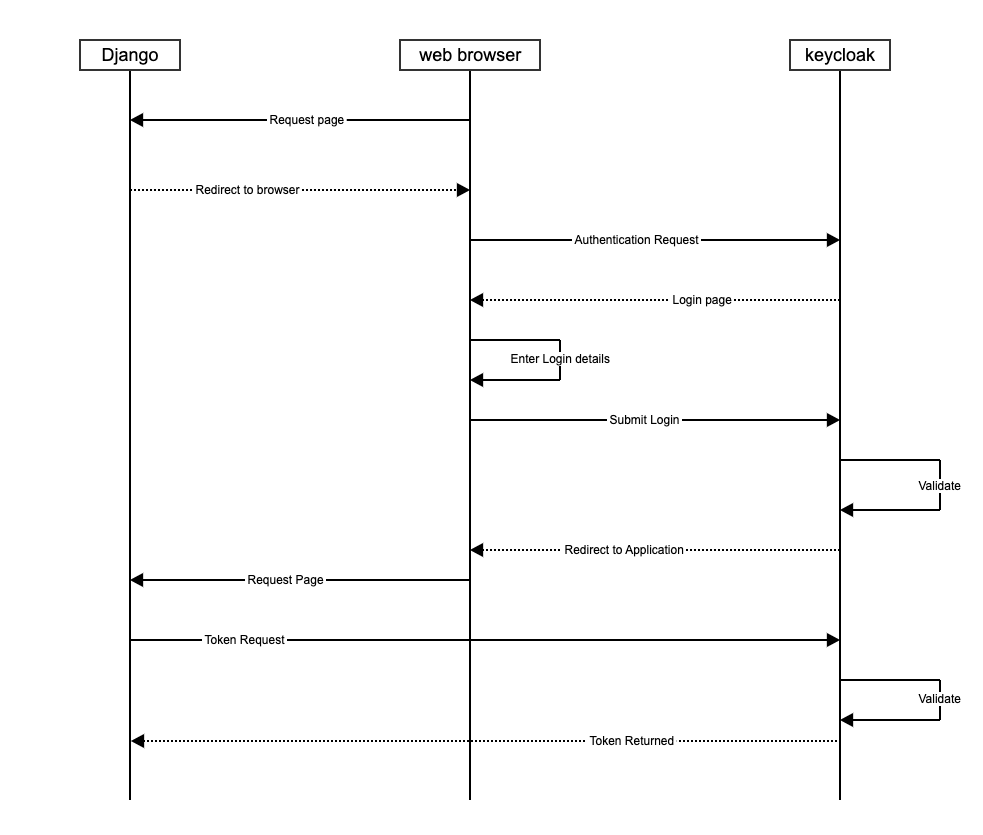

# django keycloak integration

Date: 15-12-2022

## Status

In Review

## Context

[Keycloak](http://www.keycloak.org/) is an open source identity and access management (IAM) and single sign on (SSO) solution from Redhat. If you have multiple web applications or services that require authentication, keycloak saves you from having to write the same authentication code over and over again, and allows your users to authenticate against multiple applications without having to log in multiple times.

[Django](https://www.djangoproject.com/) is a high-level Python web framework that encourages rapid development and clean, pragmatic design. Built by experienced developers, it takes care of much of the hassle of web development, so you can focus on writing your app without needing to reinvent the wheel. It’s free and open source.

### Flow diagram

OIDC is an authentication protocol that is an extension of OAuth 2.0. OAuth 3.0 is only a framework for building authorisation protocols, but OIDC is a full-fledged authentication and authorisation protocol. OIDC authentication flow when integrated with keycloak:

1. Browser visits application.
2. The application notices the user is not logged in, so it redirects the browser to keycloak to be authenticated.
3. The application passes along a call-back URL(a redirect URL) as a query parameter in this browser redirect that keycloak will use when it finishes authentication.
4. Keycloak authenticates the user and creates a one-time, very short lived, temporary code.
5. Keycloak redirects back to the application using the call-back URL provided earlier and additionally adds the temporary code as a query parameter in the call-back URL.
6. The application extracts the temporary code and makes a background out of band REST invocation to keycloak to exchange the code for an identity, access and refresh token.
7. Once this temporary code has been used to obtain the tokens, it can never be used again. This prevents potential replay attacks.

## Decision

The team were evaluating two libraries:

- [django-allauth](https://github.com/pennersr/django-allauth)
- [mozilla-django-oidc](https://github.com/mozilla/mozilla-django-oidc)

The recommendation is to use the `mozilla-django-oidc` library: 
* it is an opensource library from the mozilla community, 
* it is released under the MPL 2.0 license, 
* it is maintained by the community 
* and the latest release is `3.0.0` from 14th of Nov 2022.

## Consequences

This [GitHub repository](https://github.com/nationalarchives/da-ayr-webapp) will be used to implement the integration.

## References

- https://www.intenct.nl/projects/django-allauth/
- https://github.com/pennersr/django-allauth
- https://django-allauth.readthedocs.io/en/latest/overview.html
- https://github.com/mozilla/mozilla-django-oidc
- https://pypi.org/project/mozilla-django-oidc/3.0.0/
- https://openid.net/developers/certified/
