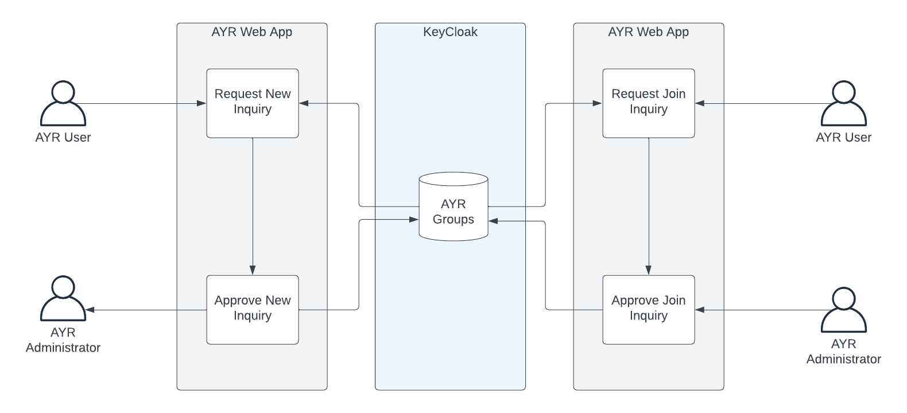

# Inquiry Mode

We currently have three user archetypes that reflect different general use cases for access to Access Your Records (AYR). 
_Frequenter_ represents the user who has uploaded their department's data and wants to access this data.
_Front-liner_ represents the TNA staff who can access all the data uploaded to AYR.

The third archetype - _Back-stager_ - represents a special, sometimes ad hoc, type of access to multiple departmental data. This is an archetype designed to capture the space inbetween the two more straightforward archetypes above.

This document is an effort to consider the typical case where a _Back-stager_ may be employed and how this might be managed by AYR in future.

## An Inquiry

An inquiry is a roughly speaking a limited scope investigation through a subset of the data available on AYR for the purposes of establishing some facts about a matter of concern to some outside agency. 
The requirements of an inquiry is that one or more AYR users who are not TNA employees be given access to records outside their own department's to enable them to conduct their investigation.
An inquiry may involve more than one user, more than one department's data and may either be indefinitely held or time-boxed with a limited amount of time to complete. It may be possible for an inquiry's time window to be renewed.
During the period of an inquiry, an AYR user (who is not a _Front-liner_) may have access to numerous records they would not normally have access to.

## Setting up Back-stagers

The simplest way to enable inquries is to use the _Back-stager_ archetype. As currently proposed, this is more a recipe than an actual role within the proposed AYR system.

A _Back-stager_ is a user who belongs to multiple **Groups** in the AYR permission model and therefore, has access to the indexed data across these groups. As currently envisioned, groups roughly correspond to government departments.

To make a user a _Back-stager_ the following steps must be taken:

1. The user must be added to the KeyCloak identity platform with valid credentials.
2. The user is added by a KeyCloak administrator to multiple groups.

That's it. 

This approach is low effort and serviceable whilst the number of ongoing inquiries is infrequent and the number of users who need to be made _Back-stagers_ are few in number.

The business has a number of outstanding questions to consider still. Amongst them:

1. How will requests to become _Back-stagers_ be handled?
2. How will _Back-stagers_ be offboarded when they no longer need their enhanced access?

## Setting up an Inquiry

In the event that the demands for _Back-stager_ users exceeds a handful that can easily be managed by non-automated processes, the following is a proposal for an additional bit of technology to assist with managing inquiries in general.

To setup an inquiry, an additional component of the web app is required that will perform the follwing function:

1. Request inquiry giving it a name and selected list of departments of concern. 
2. An administrator approves the request for an inquiry which results in a new group being created in KeyCloak. This new group inherits additional roles from the pre-existing departmental groups.
3. Users request to join the newly created inquiry.
4. An administrator approves the request for joining an inquiry which results in the user being added to the appropriate group in KeyCloak.
5. The user searches for data in the normal way. As they do so, the roles associated with the inquiry group are added to their criteria of their search. This allows them to access data across the departments which are in the scope of the inquiry.

