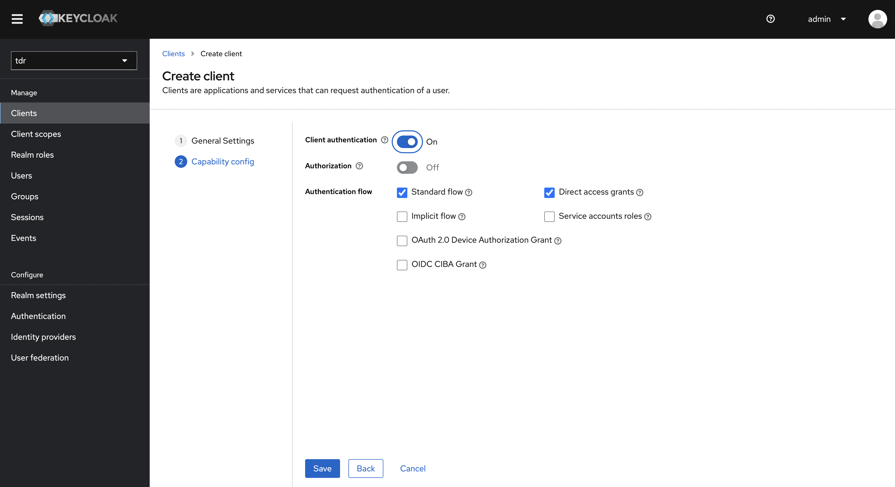
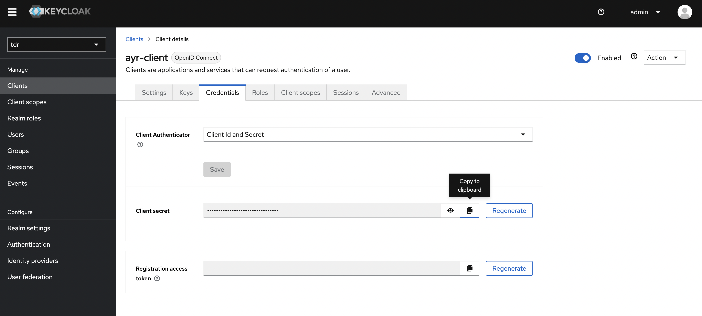

# KeyCloak Federation

This documents covers how to use KeyCloak federation in order to give AYR users a single sign on experience when they are also TDR users.

To achieve this, we need to use federation which delegates authentication from one KeyCloak instance to another authentication platform using OpenID Connect. In this case, this is connecting AYR's KeyCloak realm to TDR's KeyCloak realm.

## Division of Responsibilities

The two KeyCloak realms have different responsibilities for managing authentication and authorisation.

TDR realm provides:
1. Primary user account entry.
2. User credentials

AYR realm provides:
1. Secondary account entry.
2. User group memberships and role assignments.

## User onboarding and login process

To add a user to AYR under this arrangement, the following steps would be undertaken.

1. The user is added to TDR and uploads their documents.
2. The user requests addition to AYR.
3. A record is added to the AYR KeyCloak matching the email address of their account used in TDR.
4. The user is assigned to the appropriate group(s) in AYR's KeyCloak.

Once the user has been added, they may use AYR with their TDR credentials.

1. The user attempts to login to AYR, providing the credentials they used for TDR.
2. KeyCloak checks whether there is a user record in AYR's KeyCloak. If there is not, the process fails. The user is given a generic credential failure message.
3. KeyCloak delegates checking the credentials provided by the user to TDR's KeyCloak. If these do no match, the process fails. The user is given a generic credential failure message.
4. If the users credentials match that on TDR's KeyCloak AND there is an appropriate entry in AYR's KeyCloak, the user is authenticated with the appropriate roles assigned to them for their AYR group memberships.

## Setting up KeyCloak Federation

### Set up on Client on TDR KeyCloak

In the "Client" section of the KeyCloak admin, a new OpenID client is configured on the TDR KeyCloak as shown below.

To finish the process, create and copy client password credentials. These will need to be passed from the TDR realm administrator to the AYR realm administrator.

Further documentation on this step can be found [here](https://www.keycloak.org/docs/latest/server_admin/#_oidc_clients).

### Set up Authentication flow on AYR KeyCloak

In the "Authentication" section of the KeyCloak admin, a bespoke authentication flow needs to be configured in the AYR KeyCloak to only allow login users for users already set up on the AYR KeyCloak. We can call this "DetectExistingUser" and set it up as follows.

Futher documentation on this step can be found [here](https://www.keycloak.org/docs/latest/server_admin/#_disabling_automatic_user_creation).

### Set up Identity Provider on AYR KeyCloak

In the "Identity Providers" section of the KeyCloak admin, a new "KeyCloak OpenID Connect" configuration is added to the AYR KeyCloak. This points to the TDR KeyCloak instance using the URLs provided from TDR's KeyCloak client configuration. 

Importantly, the identity provider should be set to use the new authentication flow as in the previous step.

Futher documentation on this step can be found [here](https://www.keycloak.org/docs/latest/server_admin/#_identity_broker_oidc).

### Federation Sign Up Option in Web Client

Once setup, the federated login option will be provided in the KeyCloak login front-end.

