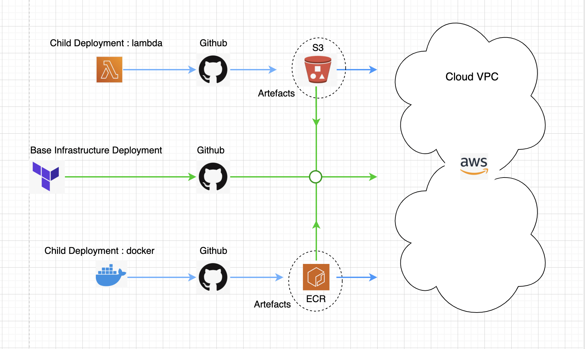

# Infrastructure Resource and Deployment Design

This document covers resources used in the infrastructure and their deployment methods. Standard deployment practices were adopted. (Continious integration and Continous deployment)

Continious Integration

Terraform and Github Actions
Gihub and Gthub actions was used as re

## General Setup
IaC
Terraform used as Infrastructure as code to deploy infrastructure resource on AWS

Code repository
Github is used as code repository for infrastructure and application

Deployment Pipelines
Github-Actions pipelnes used for buildng artefacts and deploying the infrastructure and application

S3 Bucket
Artifacts are stored in s3 bucket 

## Infrastructure Resource

Core Resource needed in the infrastructore are:
1. Virtual Private Cloud: Host the application on the Cloud in AWS using VPC, Subnets etc
2. Data Storage/Source: Relational Databases for the service i.e  Posgres, S3 Buckets
3. Server/Cluster: Docker containers on ECS Cluster for running the applications
4. Serverless Resources: Lambda functins, API gateway for ingesting and transforming data

## Deployment Design

Main Deployment:
This is the deployment of the base infrastructure, this include vpc, subnets internet gateway database, security groups etc

Child Deployment: 
This is the deployments of the applications and serverless resources i.e lambda and ecr/ecs. Child deployment can be done independent of the Main as long as the Main already exist.

Below is a diagram of the deployment strategy used that allows a base deployment but also independent application deployment

## Findings  

Serverless Design
The service is performing multiple tasks that are intermittent, i.e ingesting and transforming data. A serverless approach was adopted. (Lambda functions, api gateway)

Containerization
A reliable service that is resourceful and can scale seamlessly was the idea behind adopting ecr and ecs cluster to host and run the authentication and search service.
