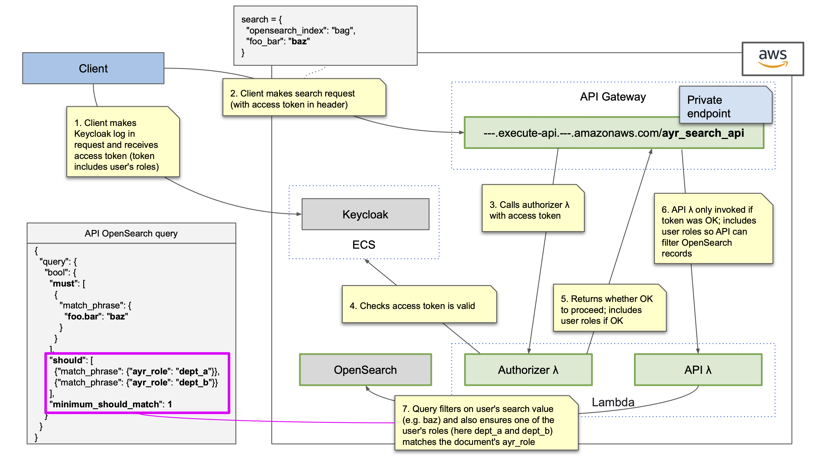

# AYR Search API Role Filtering

This document describes how access to AYR records stored in OpenSearch can be
secured by an AYR search API that uses Keycloak authentication tokens to
restrict user access to only records they are allowed to see.

ADR [009-securing-opensearch-data.md](009-securing-opensearch-data.md)
provides a summary of this and other possible approaches.

# OpenSearch Record Role Tagging

An AYR bag record will be represented as JSON for OpenSearch indexing.

So the AYR search API can filter such records according to a user's assigned
KeyCloak roles, it is proposed that the following top-level structure be used
to save these `bag_data` records in OpenSearch:

```json
{
  "ayr_role": "dept_a",
  "bag_s3_url": "s3://foo/ayr-in/TDR-2023-ABC.tar.gz",
  "bag_data": {}
}
```

| Field        | Description                                                  |
|--------------|--------------------------------------------------------------|
| `ayr_role`   | The AYR Keycloak role name assigned to the record            |
| `bag_s3_url` | An additional top-level field that could be added            |
| `bag_data`   | The JSON representation of the bag to be saved in OpenSearch |

Additional top-level fields could be added as required.

# AYR Search API Authentication Flow

The AYR Search API can be deployed as a Lambda function though API Gateway.

Access can be secured using an API Gateway Lambda function that:

1. Verifies with Keycloak that a user request session token is valid (failing
    if it is not)
2. Returns the calling user's role information for inclusion in the Search API
    Lambda's input event (for subsequent record filtering)

Steps 1 through 7 in the following diagram illustrate this process:


