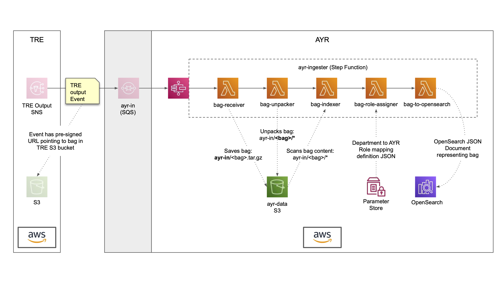

# AYR Bag Role assignment

This document describes how AYR can automatically store each Bag file received
from TRE in OpenSearch as a JSON record with an associated AYR Role.

User queries via the AYR search API will automatically match the user's
session roles against the AYR Role assigned to each OpenSearch record. This
means users will only see records they have access to. See ADR
[013-search-api-ayr-role-filter.md](013-search-api-ayr-role-filter.md) for
further details.

# AYR Ingest Process

An `ayr-ingest` process can be implemented as a Step Function with separate
Lambda functions to perform specific tasks.

The following diagram and table describe the overall process, with the output
of each Lambda function providing the input to the next one:



| Item                | Description                                                                                                      |
|---------------------|------------------------------------------------------------------------------------------------------------------|
| `ayr-ingester`      | Step Function to receive and process incoming TRE event Bag files                                                |
| `ayr-data`          | S3 bucket for storing, unpacking and scanning bag files                                                          |
| `ParameterStore`    | Holds a dictionary that maps Bag department names to AYR Keycloak Roles; see example below                       |
| `OpenSearch`        | Managed OpenSearch instance for Bag JSON records                                                                 |
| `bag-receiver`      | Lambda function to save the Bag `tar.gz` file from the incoming TRE event's pre-signed URL to an AYR S3 location |
| `bag-unpacker`      | Lambda function to unpack the Bag `tar.gz` file saved in the previous step (unpacks to S3)                       |
| `bag-indexer`       | Creates a JSON record representation of the unpacked Bag files that can be stored in OpenSearch                  |
| `bag-role-assigner` | Uses the "department to role" mapping dictionary to assign an AYR Role to the Bag JSON record                    |
| `bag-role-assigner` | Stores the Bag JSON record representation in OpenSearch                                                          |

An example bag department to AYR Role mapping dictionary:

```json
[
  {"bag_department": "Finance", "ayr_role": "finance"},
  {"bag_department": "Engineering", "ayr_role": "engineering"},
  {"bag_department": "Sales and Marketing", "ayr_role": "sam"}
]
```
